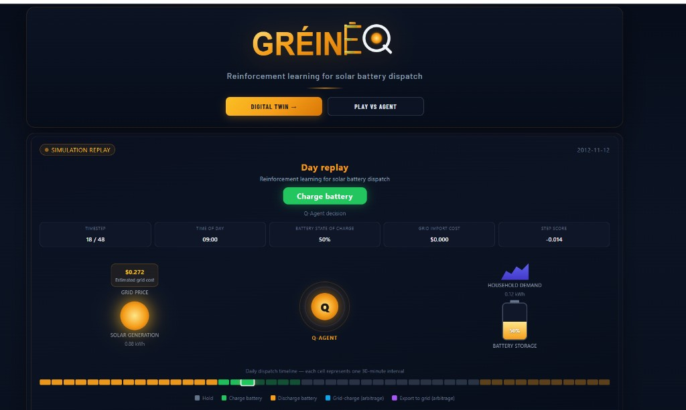
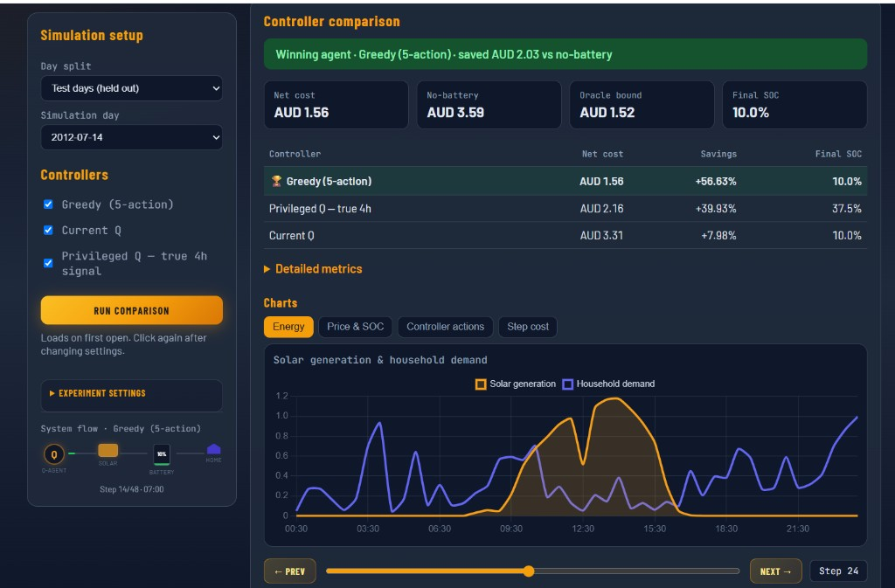
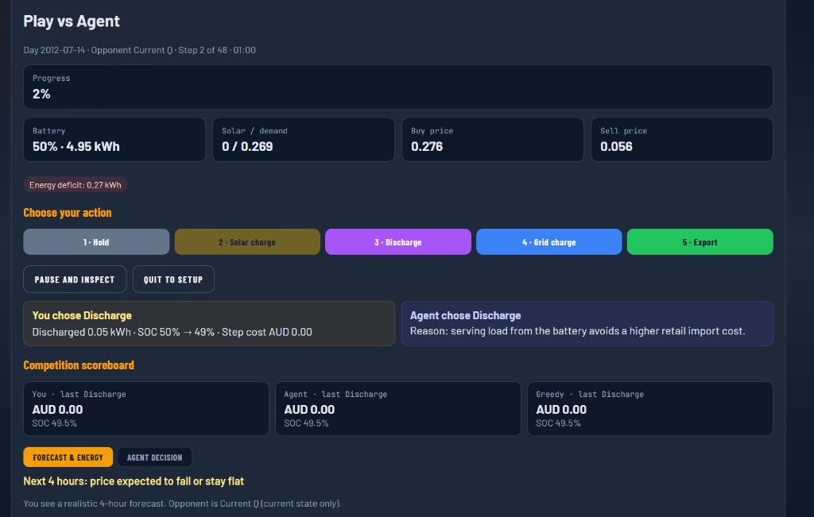

# GréineQ

Tabular reinforcement learning for residential battery dispatch on a solar-connected microgrid. Agents learn when to **hold**, **solar-charge**, **discharge**, **grid-charge**, or **export**, using Ausgrid half-hourly household data and AEMO NSW1 wholesale prices (Customer 1; 48 steps per day).

**Brand spelling:** GréineQ (filenames may use ASCII `GreineQ`).

| Resource | Link |
|----------|------|
| **Live app** | [https://greineq-agent.sudocod.com/](https://greineq-agent.sudocod.com/) |
| **User guide** | [`deliverables/GreineQ_User_Guide.md`](deliverables/GreineQ_User_Guide.md) |
| **CA02 cover note** | [`deliverables/B9AI105_Group_CA02_Cover_Note.md`](deliverables/B9AI105_Group_CA02_Cover_Note.md) |
| **Final presentation (PPTX)** | [`deliverables/presentation/GreineQ_CA2_Presentation.pptx`](deliverables/presentation/GreineQ_CA2_Presentation.pptx) |
| **Presentation + recording (Drive)** | [Google Drive folder](https://drive.google.com/drive/folders/12vc-RRwxKix4hWDKO1u6VhppgT2KjyNz?usp=sharing) |

---

## Live app

**Published instance:** [https://greineq-agent.sudocod.com/](https://greineq-agent.sudocod.com/)  
*(Production may lag `ca2_agent` — run locally for the latest Twin / Play / Results UI.)*

| View | Description |
|------|-------------|
| **Overview** | Landing page with heuristic day-replay preview (not the trained Q agent) |
| **Digital Twin** | Same-day controller comparison, KPIs, charts, timestep inspector |
| **Price Monitor** | Live AEMO NSW1 price + typical PV/load (informational; not historical Twin) |
| **Agent Play** | You vs RL vs Greedy on identical twins — oversight demo |
| **Results** | Curated CA2 headline chart, KPIs, and interpretation |

### Screenshots

**Digital Twin — simulation replay** (Q-agent decision, SOC, daily dispatch timeline):



**Digital Twin — same-day controller comparison** (KPIs, results table, energy chart):



**Agent Play** (human vs Current Q vs Greedy, with forecast panel):



### Run locally

**Web Twin (primary UI):**

```powershell
cd rl-battery-dispatch
.\run_web.ps1
# → http://localhost:8080
```

**Streamlit (optional, local research):**

```powershell
.\run_dashboard.ps1
# or: python -m streamlit run dashboard/app.py --server.port 8501
# → http://localhost:8501
```

Smoke check: `python scripts/system_test.py`.

### Demo notes

- **Digital Twin:** Auto-runs once on first open; after settings change, click **Run comparison** again.
- **Privileged Q (Twin):** labelled “true 4h signal” and always evaluated with **oracle** direction (Web Twin and Streamlit).
- **Agent Play:** You receive a **realistic** 4h forecast; Privileged opponents may use a **true** direction signal — framed as an **interactive oversight demo**, not a scientifically fair contest.
- Suggested Twin/demo day: `2012-07-14` with `forecast_exp` models (seed 42) under `results/models/` (see that folder’s README).
- Landing animation = heuristic preview, not the trained Q-Learning agent.
- Prefer **Test (held-out)** days for demos. **Lower net cost is better.**
- **Models are gitignored:** copy trained `.npy` files into `results/models/` (or retrain) before Twin / Play.

---

## CA2 contribution: forecast-information experiment

**Question:** Does a short **three-bin price-direction** foresight feature help tabular RL beat a strong greedy baseline under a fair, arbitrage-capable MDP?

### Controllers compared

| Controller | Information | Role |
|------------|-------------|------|
| No-battery reference | — | Cost reference (not an “upper bound”) |
| Perfect foresight | Full future prices | Lower-cost information bound |
| Greedy (5-action) | Current state + price | Best evaluated **deployable** controller |
| Current Q | Current state + price | Tabular Q-Learning |
| Privileged Q | Current + **true** 4h direction (3 bins) | Information probe on that feature |

Primary algorithm: **Q-Learning** (ε-greedy train, argmax eval). SARSA and Double Q-Learning are supported in the same pipeline and Twin **Experiment settings**.

### Modelling (wholesale-exposed tariff)

Experimental wholesale-exposed export — **not** a normal Australian household FiT:

```text
export revenue = exported_kWh × wholesale AUD/kWh
wholesale AUD/kWh = AEMO AUD/MWh ÷ 1000
```

Also: charge/discharge efficiency (0.95), cycling cost, SOC/power limits, no simultaneous charge+export, and terminal SOC valuation.  
**Reward** = negative adjusted electricity cost (so Q-Learning maximises reward by minimising cost).

### Privileged foresight signal

```text
future_signal = max(price over next 8 half-hours) − current price
→ FALL_OR_FLAT | MODERATE_RISE | STRONG_RISE   (train-only tertiles)
```

| Mode (`config.yaml` → `forecast.mode`) | Meaning |
|----------------------------------------|---------|
| `oracle` | **True** future direction (headline CA2 probe) |
| `forecast` | Realistic climatology + persistence (available in deployment; **not** the source of headline AUD totals) |

State sizes: Current **540** · Privileged **1620** (540 × 3 foresight bins).

### Headline results (true-direction privileged Q)

Wholesale-export · 53 held-out test days · Q-Learning 10k episodes × seeds 42–46:

| Controller | Net cost (AUD) |
|------------|----------------|
| Perfect foresight bound | 74.92 |
| **Greedy (5-action)** | **90.39** (~43.8% vs no-battery) |
| Current Q (mean ± std) | 124.23 ± 11.65 |
| Privileged Q — true 4h direction | 139.68 ± 5.55 |
| No-battery reference | 160.75 |

**Finding:** Greedy remained the best evaluated deployable controller. A coarse three-bin true direction feature alone did **not** improve Q-Learning under this setup (privileged cost *more* than Current Q on average). The hypothesis was **not supported** under this experimental setup.

Do **not** mix these totals with older fixed-FiT CA2 runs.

### Run the experiment

Headline Results numbers use the **true-direction (oracle)** privileged probe on 53 held-out days × seeds 42–46.
`config.yaml` may keep `forecast.mode: forecast` for deployable-style training; the Twin Privileged checkbox still evaluates with **oracle**.

```bash
# Realistic forecast mode (deployable-style signal / Twin default model tag)
python -m src.forecast_info_experiment --foresight forecast --agents q_learning \
  --episodes 10000 --seeds 42 43 44 45 46 --tag forecast_exp

# True-direction (oracle) privileged probe — matches headline Results framing
python -m src.forecast_info_experiment --foresight oracle --agents q_learning \
  --episodes 10000 --seeds 42 43 44 45 46 --tag oracle_priv

# Multi-agent + smoke
python -m src.forecast_info_experiment --foresight forecast \
  --agents q_learning sarsa double_q_learning \
  --episodes 10000 --seeds 42 43 44 45 46 --tag multi_agent
python -m src.forecast_info_experiment --quick --foresight forecast --tag smoke
```

Outputs: `results/logs/forecast_exp_*.csv`, plots under `results/plots/`, models under `results/models/`.  
Write-up: [`deliverables/notebooklm/CA2_Forecast_Info_Experiment_Findings.md`](deliverables/notebooklm/CA2_Forecast_Info_Experiment_Findings.md).

---

## Presentation pack

**Final deck (this submission):** [`deliverables/presentation/GreineQ_CA2_Presentation.pptx`](deliverables/presentation/GreineQ_CA2_Presentation.pptx)  
(Copied from `CA2/GréineQ_RL_Battery_Dispatch_(2).pptx`.)

**Recording + shared folder:** [https://drive.google.com/drive/folders/12vc-RRwxKix4hWDKO1u6VhppgT2KjyNz?usp=sharing](https://drive.google.com/drive/folders/12vc-RRwxKix4hWDKO1u6VhppgT2KjyNz?usp=sharing)

**CA02 cover note:** [`deliverables/B9AI105_Group_CA02_Cover_Note.md`](deliverables/B9AI105_Group_CA02_Cover_Note.md)

---

## Earlier CA2 work (grid-charge / export MDP)

CA1 was solar-only (3 actions). CA2 first extended the MDP to 5 actions and showed that allowing arbitrage lowers the *oracle* ceiling, while reactive heuristics / coarse tabular RL can still underperform greedy self-use. See [`deliverables/notebooklm/CA2_Arbitrage_Extension_Findings.md`](deliverables/notebooklm/CA2_Arbitrage_Extension_Findings.md).

---

## Requirements

- Python 3.10+

```bash
pip install -r requirements.txt
```

Includes FastAPI / Uvicorn (Web Twin), Streamlit, matplotlib, plotly, pandas, numpy, scipy, PyYAML, Pillow.  
Run all commands from the repository root (`rl-battery-dispatch/`).

## Data

| Source | Location | Description |
|--------|----------|-------------|
| Ausgrid Solar Home Data | `Ausgrid_solar_home_data/` | Half-hourly PV and household load |
| AEMO NSW1 prices | `aemo/` | Regional reference price (RRP) |
| Merged dataset | `data/merged_30min_v2.csv` | Aligned 30-min rows (customers 1–5) |
| Day split | `data/day_split.json` | Chronological train / validation / test |

## Repository layout

```
├── config.yaml
├── requirements.txt
├── docs/screenshots/               # README UI screenshots
├── src/
│   ├── environment.py              # Microgrid MDP (5 actions, wholesale export)
│   ├── physics.py                  # Efficiencies, cycling, SOC limits
│   ├── discretizer.py              # 540 / 1620 states + three-bin foresight
│   ├── price_forecast.py           # Climatology + persistence forecasts
│   ├── forecast_info_experiment.py # Main CA2 experiment runner
│   ├── oracle.py / rule_baseline.py / train.py / replay.py
│   ├── live_feed.py                # Live AEMO NSW1
│   └── agents/                     # Q-Learning, SARSA, Double Q-Learning
├── webapp/                         # FastAPI Web Twin (published UI)
│   ├── main.py / play_engine.py / landing_hero.py
│   └── static/                     # index.html, app.js, styles
├── dashboard/                      # Streamlit twin (local research)
│   ├── app.py                      # Routing + Digital Twin
│   ├── twin_panels.py              # Twin KPIs, charts, inspector, live panel
│   ├── play_vs_agent.py            # Play vs Agent game
│   └── landing_page.py / theme.py / dispatch_widget.py
├── scripts/
│   ├── system_test.py
│   ├── build_ca2_cover_note.py
│   └── build_user_guide_docx.py
├── deliverables/
│   ├── GreineQ_User_Guide.md
│   ├── B9AI105_Group_CA02_Cover_Note.md
│   ├── presentation/GreineQ_CA2_Presentation.pptx   # final CA2 deck
│   └── notebooklm/                 # CA2 findings write-ups
├── results/
│   └── models/README.md            # How to obtain / place Q-tables
├── Dockerfile/
└── data/
```

## Quick start (single-agent train)

```bash
python -m src.train --agent q_learning --episodes 10000 --tag current
python -m src.train --agent q_learning --episodes 10000 --privileged --tag privileged
python -m src.train --agent sarsa --episodes 10000 --tag current
python -m src.train --agent double_q_learning --episodes 10000 --tag current
```

## Configuration (`config.yaml`)

| Section | Key settings |
|---------|----------------|
| `battery` | Capacity, power, SOC bands, efficiencies, cycling cost |
| `tariff` | Retail margin, `export_pricing: wholesale\|fixed`, terminal SOC value |
| `forecast` | `mode` (`oracle` / `forecast`), horizon (8 steps), persistence α, noise |
| `reward` | Weights including export revenue and cycling |
| `training` | α, γ, ε schedule, episodes, seed |

## Metrics

| Metric | Description |
|--------|-------------|
| `grid_cost_aud` / `total_grid_cost_aud` | Net household cost (imports − export + cycling + terminal SOC) |
| `export_revenue_aud` | Export income under the configured tariff |
| `grid_charge_cost_aud` | Cost of deliberate grid charging |
| `net_arbitrage_profit_aud` | Arbitrage balance (export revenue − grid-charge cost) |
| Day win rate | % of test days with lowest cost vs other controllers |

## Design notes

- **Export honesty:** wholesale-exposed export is experimental. Round-trip sell is hard (retail margin ≈ 0.22 AUD/kWh + efficiency/cycling); profitable foresight is mostly “buy cheap → serve load later.”
- **Ethics / deployment:** experimental tariff and partial live inputs are disclosed; Price Monitor is informational; Play is an oversight demo; this is a software twin, not a physical battery.
- Chronological train/val/test; foresight thresholds fitted on **train only**.

## Docker (Web Twin)

Publishes the **FastAPI web app** (container port **8000**, host default **8501**).  
See [`Dockerfile/README.md`](Dockerfile/README.md).

```bash
docker compose -f Dockerfile/docker-compose.yml up -d --build
# health: http://localhost:8501/api/health
```

Local web without Docker: `.\run_web.ps1` → http://localhost:8080  
Streamlit (optional local): `python -m streamlit run dashboard/app.py`

## License

Research and educational use. Raw Ausgrid and AEMO datasets are subject to their respective terms of use.
