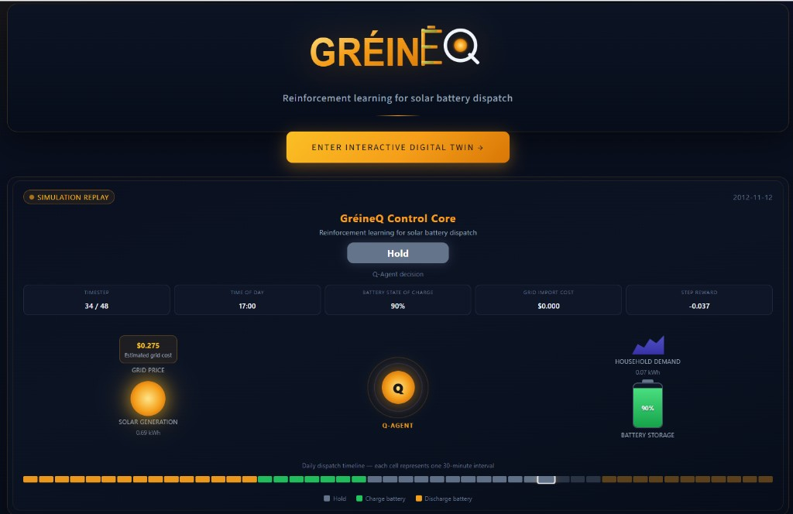
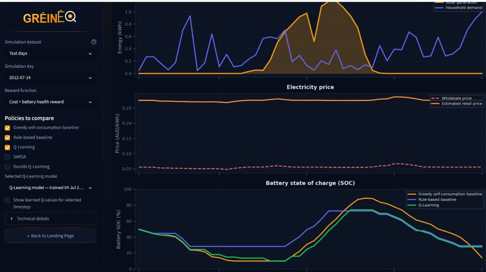

# GréineQ

Tabular reinforcement learning for residential battery dispatch on a solar-connected microgrid. The agent learns when to **hold**, **charge** from surplus solar, or **discharge** to offset load, using Ausgrid half-hourly household data and AEMO NSW1 wholesale prices (Customer 1; 48 steps per day).

## Live dashboard

**Published instance:** [https://greineq-agent.sudocod.com/](https://greineq-agent.sudocod.com/)

The landing page replays a full 48-step day with the Q-Agent control core, solar generation, battery SOC, and dispatch timeline. The interactive digital twin compares greedy self-consumption, rule-based, and trained RL policies on any train, validation, or test day.

| View | Description |
|------|-------------|
| Landing / control core | Animated day replay, KPI strip, and dispatch timeline |
| Interactive digital twin | Policy comparison charts, sidebar filters, Q-table inspection |





## Overview

GréineQ provides a reproducible pipeline from raw metering data to trained dispatch policies:

- Custom MDP environment (`MicrogridEnv`) with deterministic battery physics
- Discretised observations (324 states, 3 actions) for tabular Q-Learning, SARSA, and Double Q-Learning
- Monetised reward aligned with household grid-import cost in AUD
- Baselines spanning a no-battery floor, perfect-foresight oracle, greedy self-consumption, and a tertile rule
- Evaluation utilities for multi-seed runs, cross-customer transfer, reward ablation, and tariff sensitivity
- Streamlit dashboard for interactive day replay and policy comparison

## Requirements

- Python 3.10+

```bash
pip install -r requirements.txt
```

Run all commands from the repository root.

## Data

| Source | Location | Description |
|--------|----------|-------------|
| Ausgrid Solar Home Data | `Ausgrid_solar_home_data/` | Half-hourly PV and household load |
| AEMO NSW1 prices | `aemo/` | Regional reference price (RRP) |
| Merged dataset | `data/merged_30min_v2.csv` | Aligned 30-min rows (customers 1–5) |
| Day split | `data/day_split.json` | Month-stratified train / validation / test partition |

Notebooks for dataset construction:

- `build_dataset.ipynb` — merge Ausgrid and AEMO
- `data_split.ipynb` — generate `day_split.json`

## Repository layout

```
├── config.yaml              # Battery, tariff, training, and reward settings
├── requirements.txt
├── src/
│   ├── environment.py       # Microgrid MDP
│   ├── physics.py           # Shared battery step dynamics
│   ├── discretizer.py       # State binning (324 states)
│   ├── oracle.py            # No-battery floor and perfect-foresight oracle
│   ├── rule_baseline.py     # Tertile rule and greedy self-consumption
│   ├── train.py             # Training entry point
│   ├── evaluate.py          # Policy evaluation and KPI aggregation
│   ├── compare.py           # Test-split comparison table
│   ├── run_seeds.py         # Multi-seed training and significance tests
│   ├── cross_customer.py    # Cross-household generalisation
│   ├── ablation_reward.py   # cost_only vs battery_aware ablation
│   ├── tariff_sensitivity.py
│   ├── visualize.py         # Policy map and Q-table plots
│   ├── replay.py            # Step-by-step trace for the dashboard
│   └── agents/
│       ├── q_learning.py
│       ├── sarsa.py
│       └── double_q_learning.py
├── dashboard/
│   ├── app.py               # Streamlit landing page and digital twin
│   ├── dispatch_widget.py   # Q-Agent energy-flow animation widgets
│   ├── landing_page.py      # Landing layout and hero
│   ├── theme.py             # Shared CSS and header components
│   └── landing_animation.py # Demo GIF builder
├── Dockerfile/              # Docker Compose + nginx deploy (see Dockerfile/README.md)
├── docs/screenshots/        # README dashboard screenshots
├── run_dashboard.ps1        # Windows launch script
├── data/
├── aemo/
└── Ausgrid_solar_home_data/
```

Training outputs are written to `results/` (logs, models, plots) and `artifacts/` (discretiser thresholds). Both directories are gitignored; regenerate them by running the scripts below.

## Quick start

### Train

```bash
python -m src.train --agent q_learning --episodes 10000 --tag main
python -m src.train --agent sarsa --episodes 10000 --tag main
python -m src.train --agent double_q_learning --episodes 10000 --tag main
```

Options: `--reward-mode` (`battery_aware` | `cost_only`), `--gamma`, `--epsilon`, `--epsilon-decay`, `--seed`, `--tag`.

Each run produces:

- `results/models/Q_<agent>_<timestamp>_<tag>.npy`
- `results/logs/train_*.csv`, `eval_*.csv`, `test_*.csv`
- `results/plots/learning_curve_*.png`, `eval_curve_*.png`
- `artifacts/bin_thresholds.json`

Double Q-Learning stores two Q-tables in one file (shape `2 × states × actions`).

### Compare policies

```bash
python -m src.compare \
  --q-model results/models/Q_q_learning_<timestamp>_main.npy \
  --sarsa-model results/models/Q_sarsa_<timestamp>_main.npy \
  --output results/logs/comparison_main.csv
```

| Policy | Role |
|--------|------|
| `no_battery` | Cost without storage (upper bound) |
| `oracle_perfect_foresight` | Minimum import cost with perfect foresight (DP lower bound) |
| `greedy_self_consumption` | Charge surplus, discharge deficit (primary heuristic baseline) |
| `rule_tertile` | Charge on top-PV tertile, discharge on top-load tertile |
| RL agents | Greedy policy from a trained Q-table |

The comparison CSV includes `total_grid_cost_aud`, `cost_saving_vs_greedy_pct`, `pct_of_oracle_savings`, self-consumption rate, self-sufficiency, and evening-peak import.

### Additional experiments

```bash
# Multi-seed robustness (optional --quick for 3000 episodes)
python -m src.run_seeds --agents q_learning sarsa --seeds 42 43 44 45 46

# Train on Customer 1, evaluate on 2–5
python -m src.cross_customer --train-customer 1 --test-customers 2 3 4 5

# Reward ablation
python -m src.ablation_reward --agent q_learning

# Retail margin sensitivity
python -m src.tariff_sensitivity --margins 0.15 0.22 0.35 --episodes 10000

# Policy visualisation
python -m src.visualize --model results/models/Q_q_learning_<timestamp>_main.npy --tag main
```

### Dashboard

```powershell
.\run_dashboard.ps1
```

```bash
streamlit run dashboard/app.py
```

Open [http://localhost:8501](http://localhost:8501). The overview page shows an animated day replay; the digital-twin view compares greedy self-consumption, the tertile rule, and trained RL policies on any train, validation, or test day.

### Docker deployment (production)

See [Dockerfile/README.md](Dockerfile/README.md) for the full guide. From the repository root:

```bash
docker compose -f Dockerfile/docker-compose.yml up -d --build
```

With nginx reverse proxy:

```bash
docker compose -f Dockerfile/docker-compose.yml --profile with-nginx up -d --build
```

The published dashboard at [https://greineq-agent.sudocod.com/](https://greineq-agent.sudocod.com/) runs from this container setup.

## Configuration

`config.yaml` controls:

| Section | Parameters |
|---------|------------|
| Battery | Capacity, power limits, SOC guard bands |
| Tariff | Retail margin, feed-in rate, degradation cost (AUD/kWh) |
| Reward | `cost_only` and `battery_aware` weight profiles |
| Training | Learning rate, discount factor, exploration schedule, episodes, seed, alpha decay |
| Data | Primary customer ID, steps per episode |

## Metrics

| Metric | Description |
|--------|-------------|
| `total_grid_cost_aud` | Sum of retail import bills over the evaluation split |
| `cost_saving_vs_greedy_pct` | Saving relative to greedy self-consumption |
| `pct_of_oracle_savings` | Share of the no-battery → oracle cost gap captured |
| `mean_self_consumption_rate` | On-site use of PV generation |
| `mean_self_sufficiency` | Load met without grid import |
| `mean_evening_peak_import_kwh` | Grid import after 17:00 local time |

## Design scope

The current simulator models **solar-only dispatch**: the battery charges from surplus PV and discharges to offset the step load deficit. Grid import for charging and export to the grid are not implemented; wholesale price is observed but actionable arbitrage is limited to timing self-consumption.

State encoding uses four coarse time-of-day bins instead of the step index, trading strict Markov sufficiency for a compact 324-state Q-table. Greedy self-consumption is the primary reference baseline; the tertile rule is retained as a weaker heuristic for comparison.

## Roadmap

- Grid-charging and export actions for price arbitrage under two-part tariffs
- Finer SOC bins and daytime-only PV binning to reduce state aliasing
- Stochastic extensions (forecast uncertainty, multi-day SOC carry-over)
- Additional hosted households and tariff profiles on the live dashboard

## License

Research and educational use. Raw Ausgrid and AEMO datasets are subject to their respective terms of use.
